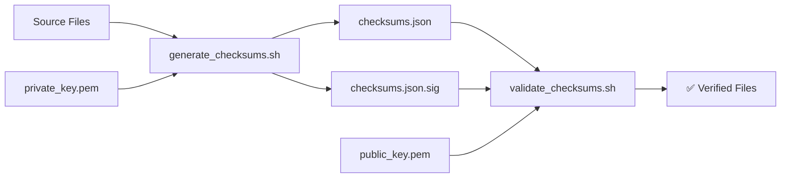

# Signature Validation Scripts

This directory contains scripts for generating and validating cryptographic signatures of your Scalr EventBridge integration files. This approach helps ensure the integrity of your infrastructure code and Lambda functions.

## 🔧 Scripts Overview

| Script                  | Purpose                                        |
|-------------------------|------------------------------------------------|
| `setup_keys.sh`         | Generate RSA key pair for signing/verification |
| `generate_checksums.sh` | Create checksums.json and sign it              |
| `validate_checksums.sh` | Verify signature and file integrity            |

## 🚀 Quick Start

1. **Setup Keys** (one-time setup)
   ```bash
   ./scripts/setup_keys.sh
   ```

2. **Generate Checksums**
   ```bash
   ./scripts/generate_checksums.sh
   ```

3. **Validate Checksums**
   ```bash
   ./scripts/validate_checksums.sh
   ```

## 🔐 Security Model



- **Private Key**: Used to sign checksums.json (keep secure!)
- **Public Key**: Used to verify signatures (safe to share)
- **checksums.json**: Contains SHA-256 hashes of all files
- **checksums.json.sig**: Cryptographic signature of the checksums

## 📋 Dynamic File Discovery

The `generate_checksums.sh` script automatically discovers files based on configurable patterns:

### Default File Types Included

- **Terraform files** (*.tf)
- **Python files** (*.py) 
- **Configuration files** (*.json, *.yaml, *.yml, *.toml, *.ini, *.cfg)
- **Shell scripts** (*.sh)
- **Documentation** (README*, LICENSE*, CHANGELOG*, CONTRIBUTING*)

### Command Line Options

```bash
# Show help
./scripts/generate_checksums.sh --help

# Generate with verbose output
./scripts/generate_checksums.sh --verbose

# Skip documentation files
./scripts/generate_checksums.sh --no-docs

# Include additional patterns
./scripts/generate_checksums.sh --include "*.md" --include "Dockerfile*"

# Exclude test files
./scripts/generate_checksums.sh --exclude "test*" --exclude "*.tmp"

# Use custom configuration
./scripts/generate_checksums.sh --config custom_config.json
```

### Configuration File

Create `scripts/checksum_config.json` to set defaults:

```json
{
  "include_terraform": true,
  "include_python": true,
  "include_config": true,
  "include_scripts": true,
  "include_docs": true,
  "include_patterns": [
    "*.md",
    "Dockerfile*",
    ".gitignore"
  ],
  "exclude_patterns": [
    "test*",
    "*.tmp",
    "*.log",
    ".DS_Store"
  ]
}
```

## 🛡️ Security Best Practices

### Key Management

1. **Private Key Security**
   ```bash
   # Secure the private key
   chmod 600 scripts/private_key.pem
   
   # Add to .gitignore
   echo "scripts/private_key.pem" >> .gitignore
   ```

2. **Production Usage**
   - Store private keys in secure vaults (AWS KMS, HashiCorp Vault, etc.)
   - Use hardware security modules (HSMs) for critical environments
   - Implement key rotation policies

### Verification Workflow

```bash
# In CI/CD pipelines
./scripts/validate_checksums.sh || exit 1

# Before deploying changes
./scripts/validate_checksums.sh && terraform apply
```

## 🔍 Troubleshooting

### Common Issues

**Missing jq**
```bash
# macOS
brew install jq

# Ubuntu/Debian
sudo apt-get install jq

# CentOS/RHEL
sudo yum install jq
```

**Permission Denied**
```bash
chmod +x scripts/*.sh
```

**Signature Verification Failed**
- File may have been modified
- Wrong public key being used
- Checksums file corrupted

**Missing Files**
- Files were moved or deleted after checksum generation
- Exclude patterns too broad
- Files not committed to git

### Debug Mode

```bash
# Enable verbose output
./scripts/generate_checksums.sh --verbose
./scripts/validate_checksums.sh
```

## 🔄 Integration Examples

### Git Pre-commit Hook

```bash
#!/bin/bash
# .git/hooks/pre-commit
./scripts/generate_checksums.sh --no-docs
git add checksums.json checksums.json.sig
```

### CI/CD Pipeline

```yaml
# GitHub Actions example
- name: Validate File Integrity
  run: |
    ./scripts/validate_checksums.sh
    
- name: Update Checksums
  if: github.event_name == 'push'
  run: |
    ./scripts/generate_checksums.sh
    # Commit updated checksums if needed
```

### Terraform Validation

```bash
#!/bin/bash
# validate-and-apply.sh
set -euo pipefail

echo "🔍 Validating file integrity..."
./scripts/validate_checksums.sh

echo "✅ Files verified, proceeding with Terraform..."
terraform plan
terraform apply
```

## 📊 Supported File Patterns

| Pattern           | Description     | Example Files               |
|-------------------|-----------------|-----------------------------|
| `*.tf`            | Terraform files | main.tf, variables.tf       |
| `*.py`            | Python files    | lambda_function.py          |
| `*.json`          | JSON configs    | package.json, tsconfig.json |
| `*.yaml`, `*.yml` | YAML configs    | docker-compose.yml          |
| `*.sh`            | Shell scripts   | deploy.sh, setup.sh         |
| `README*`         | Documentation   | README.md, README.txt       |
| `LICENSE*`        | License files   | LICENSE, LICENSE.md         |

## 🎯 Use Cases

- **Infrastructure as Code**: Verify Terraform modules before deployment
- **Lambda Functions**: Ensure Python code hasn't been tampered with
- **CI/CD Security**: Validate code integrity in pipelines
- **Compliance**: Meet security requirements for file integrity
- **Change Detection**: Identify unauthorized modifications

## 🤝 Contributing

1. Test changes with various file patterns
2. Update documentation for new features
3. Ensure backward compatibility
4. Add appropriate error handling 