# Signature Validation Scripts

This directory contains scripts for generating and validating cryptographic signatures of your Scalr EventBridge integration files. This approach helps ensure the integrity of your infrastructure code and Lambda functions.

## 🔧 Scripts Overview

| Script                  | Purpose                                        |
|-------------------------|------------------------------------------------|
| `setup_keys.sh`         | Generate RSA key pair for signing/verification |
| `generate_checksums.sh` | Create checksums.json and sign it              |
| `validate_checksums.sh` | Verify signature and file integrity            |

## 🚀 Quick Start

1. **Setup Keys** (one-time setup)
   ```bash
   ./setup_keys.sh
   ```

2. **Generate Checksums**
   ```bash
   ./generate_checksums.sh
   ```

3. **Validate Checksums**
   ```bash
   ./validate_checksums.sh
   ```

## 🔐 Security Model

```mermaid
graph LR
    A[Source Files] --> B[generate_checksums.sh]
    B --> C[checksums.json]
    B --> D[checksums.json.sig]
    E[private_key.pem] --> B
    E2[SCALR_PRIVATE_KEY] --> B
    C --> F[validate_checksums.sh]
    D --> F
    G[public_key.pem] --> F
    G2[SCALR_PUBLIC_KEY] --> F
    F --> H[✅ Verified Files]
```



- **Private Key**: Used to sign checksums.json (keep secure!)
  - File: `private_key.pem` 
  - Environment: `SCALR_PRIVATE_KEY` or custom variable
- **Public Key**: Used to verify signatures (safe to share)
  - File: `public_key.pem`
  - Environment: `SCALR_PUBLIC_KEY` or custom variable  
- **checksums.json**: Contains SHA-256 hashes of all files
- **checksums.json.sig**: Cryptographic signature of the checksums

## 🔑 Environment Variable Support

For enhanced security and CI/CD integration, keys can be provided via environment variables instead of files:

### Built-in Environment Variables

| Variable            | Purpose             | Usage               |
|---------------------|---------------------|---------------------|
| `SCALR_PRIVATE_KEY` | Private key content | Automatic detection |
| `SCALR_PUBLIC_KEY`  | Public key content  | Automatic detection |

### Custom Environment Variables

```bash
# Use any variable name you prefer
export MY_COMPANY_PRIVATE_KEY="$(cat path/to/private.pem)"
export MY_COMPANY_PUBLIC_KEY="$(cat path/to/public.pem)"

./generate_checksums.sh --key-env MY_COMPANY_PRIVATE_KEY
./validate_checksums.sh --key-env MY_COMPANY_PUBLIC_KEY
```

### Priority Order (Private Key)

1. `--key-env CUSTOM_VAR` (if specified)
2. `SCALR_PRIVATE_KEY` environment variable  
3. `PRIVATE_KEY` environment variable (if different from default file path)
4. `private_key.pem` file (fallback)

### Priority Order (Public Key)

1. `--key-env CUSTOM_VAR` (if specified)
2. `SCALR_PUBLIC_KEY` environment variable
3. `PUBLIC_KEY` environment variable (if different from default file path)  
4. `public_key.pem` file (fallback)

### Security Benefits

- ✅ **No keys in repository** - Environment variables keep secrets out of code
- ✅ **CI/CD ready** - Perfect for GitHub Actions, GitLab CI, Jenkins, etc.
- ✅ **Vault integration** - Easy integration with secret management systems
- ✅ **Temporary usage** - Keys exist only in memory during execution
- ✅ **Audit friendly** - No persistent key files in production environments

### Example Usage Patterns

```bash
# Method 1: Standard environment variables
export SCALR_PRIVATE_KEY="$(cat private_key.pem)"
export SCALR_PUBLIC_KEY="$(cat public_key.pem)"
./generate_checksums.sh
./validate_checksums.sh

# Method 2: Custom variable names  
export COMPANY_SIGN_KEY="$(vault kv get -field=private_key secret/signing)"
export COMPANY_VERIFY_KEY="$(vault kv get -field=public_key secret/signing)"
./generate_checksums.sh --key-env COMPANY_SIGN_KEY
./validate_checksums.sh --key-env COMPANY_VERIFY_KEY

# Method 3: Direct from secret management
SCALR_PRIVATE_KEY="$(aws secretsmanager get-secret-value --secret-id scalr-private-key --query SecretString --output text)" \
./generate_checksums.sh
```

## 📋 Dynamic File Discovery

The `generate_checksums.sh` script automatically discovers files based on configurable patterns:

### Default File Types Included

- **Terraform files** (*.tf)
- **Python files** (*.py) 
- **Configuration files** (*.json, *.yaml, *.yml, *.toml, *.ini, *.cfg)
- **Shell scripts** (*.sh)
- **Documentation** (README*, LICENSE*, CHANGELOG*, CONTRIBUTING*)

### Command Line Options

```bash
# Show help
./generate_checksums.sh --help

# Generate with verbose output
./generate_checksums.sh --verbose

# Skip documentation files
./generate_checksums.sh --no-docs

# Include additional patterns
./generate_checksums.sh --include "*.md" --include "Dockerfile*"

# Exclude test files
./generate_checksums.sh --exclude "test*" --exclude "*.tmp"

# Use custom configuration
./generate_checksums.sh --config custom_config.json

# Use environment variables for keys (recommended for CI/CD)
export SCALR_PRIVATE_KEY="$(cat private_key.pem)"
./generate_checksums.sh

# Use custom environment variable names
export MY_PRIVATE_KEY="$(cat private_key.pem)"
./generate_checksums.sh --key-env MY_PRIVATE_KEY
```

### Configuration File

Create `checksum_config.json` to set defaults:

```json
{
  "include_terraform": true,
  "include_python": true,
  "include_config": true,
  "include_scripts": true,
  "include_docs": true,
  "include_patterns": [
    "*.md",
    "Dockerfile*",
    ".gitignore"
  ],
  "exclude_patterns": [
    "test*",
    "*.tmp",
    "*.log",
    ".DS_Store"
  ]
}
```

## 🛡️ Security Best Practices

### Key Management

1. **Private Key Security**
   ```bash
   # Secure the private key file
   chmod 600 private_key.pem
   
   # Add to .gitignore
   echo "private_key.pem" >> .gitignore
   ```

2. **Environment Variable Usage (Recommended)**
   ```bash
   # Load from existing files
   export SCALR_PRIVATE_KEY="$(cat private_key.pem)"
   export SCALR_PUBLIC_KEY="$(cat public_key.pem)"
   
   # Use in scripts
   ./generate_checksums.sh
   ./validate_checksums.sh
   ```

3. **Production Usage**
   - Store keys in secure vaults (AWS KMS, HashiCorp Vault, etc.)
   - Use environment variables instead of files in CI/CD
   - Use hardware security modules (HSMs) for critical environments
   - Implement key rotation policies
   - Never commit private keys to repositories

### Verification Workflow

```bash
# In CI/CD pipelines
./validate_checksums.sh || exit 1

# Before deploying changes
./validate_checksums.sh && terraform apply
```

## 🔍 Troubleshooting

### Common Issues

**Missing jq**
```bash
# macOS
brew install jq

# Ubuntu/Debian
sudo apt-get install jq

# CentOS/RHEL
sudo yum install jq
```

**Permission Denied**
```bash
chmod +x *.sh
```

**Signature Verification Failed**
- File may have been modified
- Wrong public key being used
- Checksums file corrupted

**Missing Files**
- Files were moved or deleted after checksum generation
- Exclude patterns too broad
- Files not committed to git

### Debug Mode

```bash
# Enable verbose output
./generate_checksums.sh --verbose
./validate_checksums.sh
```

## 🔄 Integration Examples

### Git Pre-commit Hook

```bash
#!/bin/bash
# .git/hooks/pre-commit
./generate_checksums.sh --no-docs
git add checksums.json checksums.json.sig
```

### CI/CD Pipeline

```yaml
# GitHub Actions example with environment variables
- name: Validate File Integrity
  env:
    SCALR_PUBLIC_KEY: ${{ secrets.SCALR_PUBLIC_KEY }}
  run: |
    ./validate_checksums.sh
    
- name: Update Checksums
  if: github.event_name == 'push'
  env:
    SCALR_PRIVATE_KEY: ${{ secrets.SCALR_PRIVATE_KEY }}
  run: |
    ./generate_checksums.sh
    # Commit updated checksums if needed

# Custom environment variable names
- name: Generate Checksums with Custom Variables
  env:
    MY_PRIVATE_KEY: ${{ secrets.COMPANY_PRIVATE_KEY }}
  run: |
    ./generate_checksums.sh --key-env MY_PRIVATE_KEY
```

### Terraform Validation

```bash
#!/bin/bash
# validate-and-apply.sh
set -euo pipefail

echo "🔍 Validating file integrity..."
./validate_checksums.sh

echo "✅ Files verified, proceeding with Terraform..."
terraform plan
terraform apply
```

## 📊 Supported File Patterns

| Pattern           | Description     | Example Files               |
|-------------------|-----------------|-----------------------------|
| `*.tf`            | Terraform files | main.tf, variables.tf       |
| `*.py`            | Python files    | lambda_function.py          |
| `*.json`          | JSON configs    | package.json, tsconfig.json |
| `*.yaml`, `*.yml` | YAML configs    | docker-compose.yml          |
| `*.sh`            | Shell scripts   | deploy.sh, setup.sh         |
| `README*`         | Documentation   | README.md, README.txt       |
| `LICENSE*`        | License files   | LICENSE, LICENSE.md         |

## 🎯 Use Cases

- **Infrastructure as Code**: Verify Terraform modules before deployment
- **Lambda Functions**: Ensure Python code hasn't been tampered with
- **CI/CD Security**: Validate code integrity in pipelines
- **Compliance**: Meet security requirements for file integrity
- **Change Detection**: Identify unauthorized modifications

## 🤝 Contributing

1. Test changes with various file patterns
2. Update documentation for new features
3. Ensure backward compatibility
4. Add appropriate error handling 